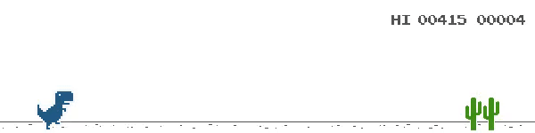

# Machine Learning Final Project (ma2823)

Implements a Deep QLearning agent to learn playing the chrome T-Rex easter egg game on chrome. Takes as input the raw game image (that is preprocessed to reduce size)

Dependencies:
* python ~3.6
* keras
* tensorflow
* pygame

To train the algorithm, you can:
* if you want to train it without rendering, python main.py
* if you want to see the training (slower), python main.py --render

To test the algorithm: python main.py --test path_to_model

To save time, you can use our model that we trained : python main.py --test models/good_model.h5

For more details refer to the project report 